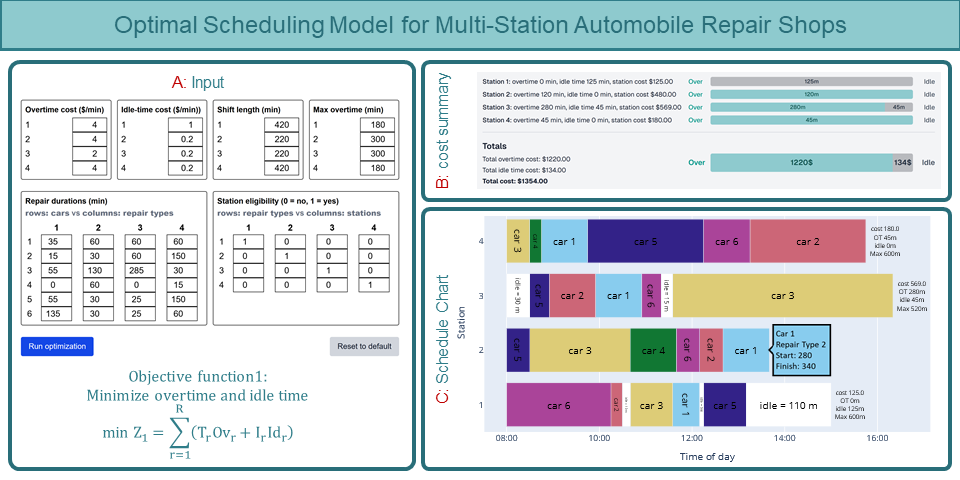
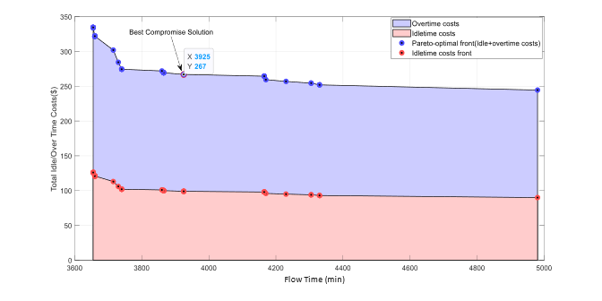

# A multi-objective open shop model for optimizing scheduling in automotive repair shops

This repository contains the source code for the paper: **"A multi-objective open shop model for optimizing scheduling in automotive repair shops"** published in the *Decision Analytics Journal (2026)*.

[](https://www.sciencedirect.com/science/article/pii/S277266222600010X)
[](https://doi.org/10.1016/j.dajour.2026.100682)
[](https://milp.netlify.app/)

## Graphical Abstract



## Overview

Efficient scheduling in automobile repair shops plays a key role in enhancing customer satisfaction while minimizing operational inefficiencies. This study addresses the daily repair scheduling problem by formulating it as a bi-objective open shop scheduling model.

### Optimization Objectives

The model focuses on two conflicting objectives:
1.  **Minimize Total Flow Time ($Z_2$):** Reducing the cumulative time cars spend in the system (customer-oriented).
2.  **Minimize Idle and Overtime Costs ($Z_1$):** Optimizing resource utilization at repair stations (resource-oriented).

## Key Features

-   **Mathematical Formulation:** A Mixed-Integer Linear Programming (MILP) model developed for exact optimization of small-to-medium instances.
-   **Metaheuristic Solution:** A modified **Non-dominated Sorting Genetic Algorithm II (NSGA-II)** featuring a station-sequence chromosome and feasibility-aware decoding for large-scale instances.
-   **Web-Based Interface:** An interactive dashboard deployed at [https://milp.netlify.app/](https://milp.netlify.app/) for visualizing schedules via Gantt charts (powered by Google OR-Tools).
-   **Real-World Application:** Validated with data from one of the largest automotive repair centers in Iran, achieving significant efficiency gains.

## Results Highlights

Computational results across various test problems and a real-world case study demonstrate:
-   **~42% reduction** in total car flow time.
-   **~47% reduction** in station idle and overtime costs.

## Trade-off Analysis

Figure 10 illustrates the trade-off relationship between total flow time and total idle/overtime costs. For Instance 1 (Table 2), representing a workday with 28 cars and 49 repair procedures, the manual schedule resulted in a total idle/overtime cost of $469 and a total flow time of 6188 minutes. The proposed NSGA-II-based approach significantly improved these values, achieving $267 for idle/overtime cost and 3925 minutes for total flow time.

To quantify this enhancement, the Objective Function Improvement (OFI) is calculated as $OFI = (\frac{|Optimal - Normal|}{Normal}) \times 100$. The algorithm reduced idle/overtime costs by approximately 43% ($\frac{|469-267|}{469} \times 100$) and total flow time by about 37%, demonstrating the effectiveness of the proposed scheduling method.

For an average across five real working days (summarized in Table 2), the proposed method achieved a 46.8% reduction in station idle and overtime cost and a 41.8% reduction in total flow time.



## Repository Structure

The code is organized into three main implementation frameworks:

-   **/Gams**: Contains the MILP model formulations (`.gms` files) solved using CPLEX.
    -   `Flow_time.gms`: Focuses on minimizing the flow time objective.
    -   `Idle_Over_time_cost.gms`: Focuses on minimizing operational costs.
-   **/MATLAB**: Implementation of the modified NSGA-II metaheuristic for large-scale optimization.
    -   `Optimizer.m`: The main entry point for the genetic algorithm.
    -   Includes operators for crossover, mutation, and non-dominated sorting.
-   **/ORtools**: Python implementation using Google OR-Tools CP-SAT solver, used for the web-based demonstration.
    -   `Idle_Overtime.py`: Core logic for the web tool's optimization engine.

## Authors

-   **Mohammad Behbahani** (Correspondence)
-   **Reza Izadbakhsh**
-   **Hamidreza Izadbakhsh**

## Citation

If you use this code or model in your research, please cite:

```bibtex
@article{behbahani2026multiobjective,
  title={A multi-objective open shop model for optimizing scheduling in automotive repair shops},
  author={Behbahani, Mohammad and Izadbakhsh, Reza and Izadbakhsh, Hamidreza},
  journal={Decision Analytics Journal},
  volume={100682},
  year={2026},
  doi={10.1016/j.dajour.2026.100682}
}
```
